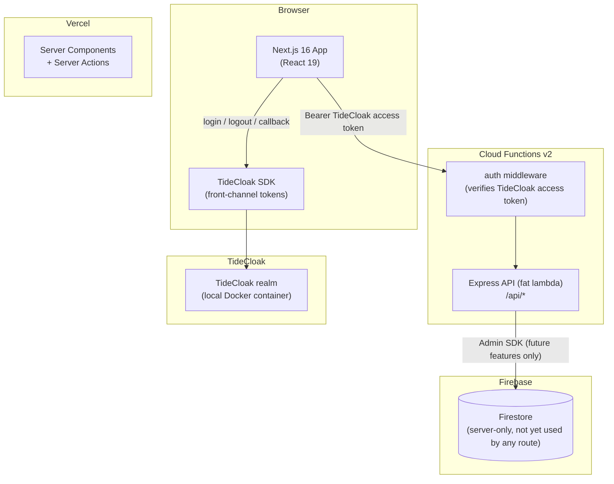
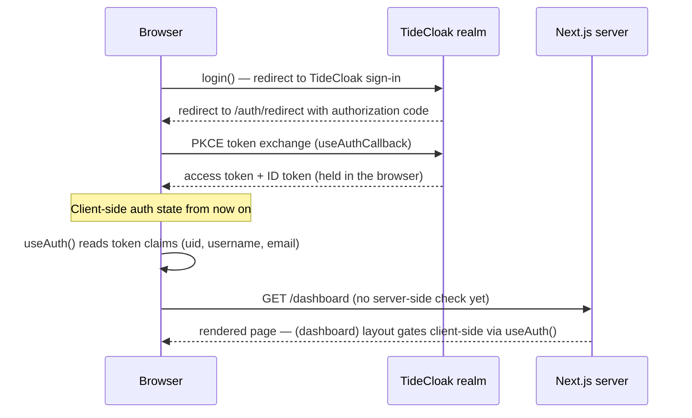

# Architecture

## System Overview

The system has three parts: a **Next.js frontend** (deployed to Vercel) using **TideCloak** for
frontend authentication, an **Express API** running as a single Cloud Function (optional —
deployed to Firebase, requires the Blaze plan) using **TideCloak** for API authentication, and
**Firestore**, reserved for future server-side backend features and accessed only by the backend
via Firebase Admin. The frontend has no Firebase SDK and never connects to Firestore directly —
`firebase/firestore.rules` denies all direct client access. TideCloak runs in a local Docker
container for development — see `docs/TIDECLOAK-LOCAL.md`.

The frontend is server-rendered (Server Actions), so it needs a server host. It deploys to
Vercel's free Hobby tier rather than Firebase Hosting, since Firebase Hosting's SSR integration
runs on Cloud Functions/Cloud Run and requires Blaze even at zero traffic — Vercel doesn't.



Current paths to the data:

| Path                                       | Used for                                    | Guarded by                                                                                                  |
| ------------------------------------------ | ------------------------------------------- | ----------------------------------------------------------------------------------------------------------- |
| Browser → Firestore                        | **Never happens** — no client SDK exists    | **Firestore security rules** deny all direct client access by default, as a defense-in-depth backstop       |
| Browser → TideCloak                        | Login, logout, silent SSO                   | **TideCloak realm** — front-channel PKCE flow                                                               |
| Browser → Server Component / Server Action | SSR pages, mutations                        | **Not yet enforced** — `requireAuth()` is a fail-closed stub pending `feature/tidecloak-protect`            |
| Browser → Express API                      | Business logic endpoints                    | **auth middleware** — verifies a **TideCloak access token** (`backend/src/middleware/auth.ts`)              |
| Express API → Firestore                    | Reserved for future features (not used yet) | TideCloak auth middleware runs first; Firebase Admin bypasses Firestore rules by design (server is trusted) |

## Authentication Flow (current — TideCloak frontend, front-channel)



**Current state:** TideCloak issues front-channel (browser-held) tokens. The `(dashboard)`
layout's client-side gate via `useAuth()` is a **UX gate only** — it does not verify anything
server-side. There is currently **no cryptographic verification** of the TideCloak session on
the server: `getServerSession()` always returns `null`, and `requireAuth()` always redirects.
Server-side TideCloak JWT verification is planned but not yet implemented (`feature/tidecloak-protect`).

**Removed:** Firebase Authentication (client SDK and backend Admin Auth), the `__session`
cookie, `proxy.ts`, and the `/api/auth/session` route no longer exist in this codebase.

## Request Patterns

### Server-rendered page (Server Component)

1. Browser requests `/dashboard`
2. The `(dashboard)` layout is a Client Component that gates via `useAuth()` — a UX redirect
   only, not a security boundary
3. HTML is streamed to the browser — no current page reads Firestore server-side

### Mutation (Server Action)

1. Client Component calls a Server Action
2. Action calls `requireAuth()` — currently always redirects (fail-closed stub); real TideCloak
   verification is future work
3. Once implemented: validates input with Zod, calls the backend's protected Express API (the
   frontend does not access Firestore directly) — returns `ActionResult<T>` —
   `{ success, error?, data? }`

### API call (Cloud Functions)

1. Client obtains a **TideCloak access token** (`useAuth().getToken()`)
2. Client sends `Authorization: Bearer {token}` to `/api/...`
3. Auth middleware (`backend/src/middleware/auth.ts`) verifies the TideCloak token and attaches
   `req.user`, including recognised SOC roles
4. Route handler validates input, checks role membership (`requireRole`/`requireAnyRole`), and
   responds — via an explicit field allow-list, never a raw data spread. Today's only feature
   route (`GET /api/incidents`) uses synthetic in-memory data, not Firestore; Firestore access
   (`adminDb` from `backend/src/lib/firebase.ts`) is reserved for future features.

## Backend Structure

The backend is deliberately flat — a single Express app in one Cloud Function:

```
backend/src/
├── index.ts        Cloud Function entry (exports `api`)
├── app.ts          Express app factory
├── routes/         One file per resource
├── middleware/     auth (TideCloak JWT → req.user), errorHandler (RFC 9457)
└── lib/            firebase (Firestore-only Admin singleton), errors (HttpError), tideJWT, tidecloakConfig
```

Two conventions are enforced by a CI test (`backend/tests/unit/conventions.test.ts`): Firebase Admin is imported only via `lib/firebase.ts`, and no `console.log` in `src/`. See `docs/BACKEND.md` for the route handler pattern.

## Security Model

- **Firestore rules** — default-deny-all for the client SDK, as a defense-in-depth backstop; the browser has no Firebase SDK and never connects to Firestore directly
- **TideCloak** — frontend login/logout/callback/silent SSO; browser-held front-channel tokens
- **Cloud Functions** — verify **TideCloak access tokens** in the auth middleware for every protected route; Firebase Authentication is not used
- **Next.js Server Actions** — call `requireAuth()`, currently a fail-closed stub; real TideCloak verification is not yet implemented
- **`(dashboard)` layout** — client-side `useAuth()` gate only; a UX redirect, not a security boundary

See `docs/SECURITY.md` for the full layered security reference, including what is and isn't implemented today.

## Key Design Decisions

**Why feature-based folder structure?**
Features in `frontend/src/features/{feature}/` are self-contained — types, hooks, actions, and components together. Deleting a feature means deleting one folder. Cross-feature imports are explicit violations of the intended boundary.

**Why Express on Cloud Functions instead of individual functions?**
The "fat-lambda" pattern keeps local development identical to production (just run Express locally), simplifies testing with supertest, and avoids cold starts multiplied across many functions.

**Why a flat backend instead of layered "clean architecture"?**
At this size, layers add indirection without payoff. The two properties that matter — swappable auth for tests and a single Firebase entry point — are kept via one injected function (`verifyToken`) and one module (`lib/firebase.ts`), both enforced by tests rather than folder structure.
