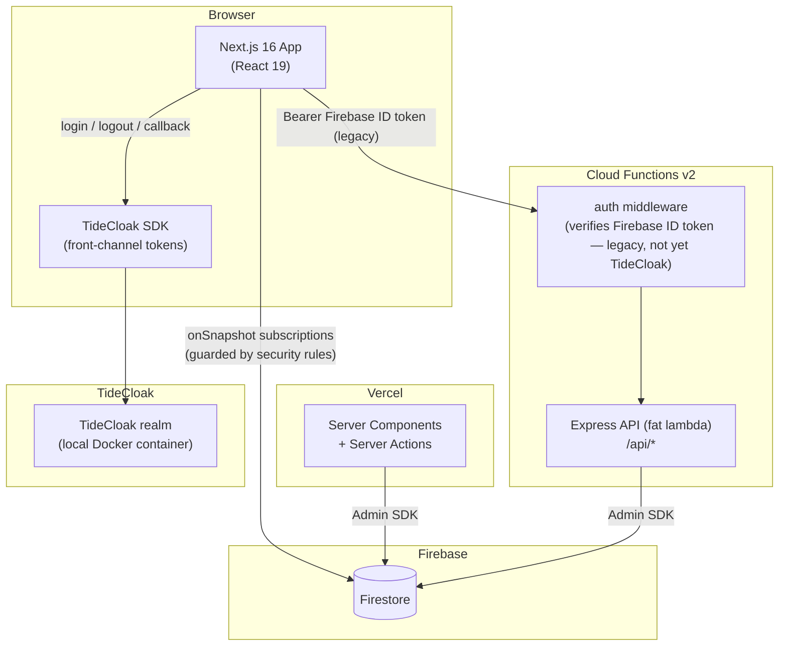
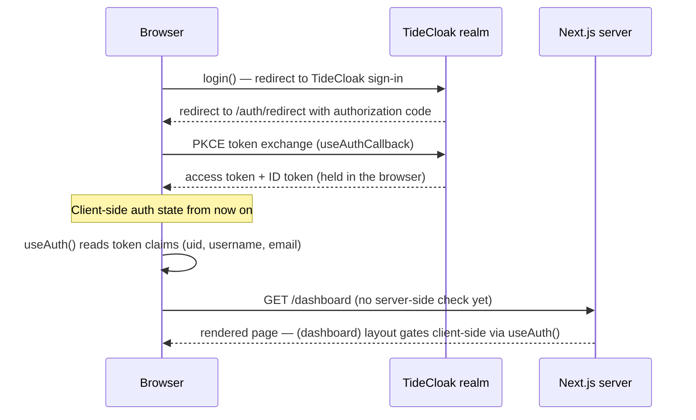

# Architecture

## System Overview

The system has three parts: a **Next.js frontend** (deployed to Vercel) using **TideCloak** for
frontend authentication, an **Express API** running as a single Cloud Function (optional —
deployed to Firebase, requires the Blaze plan), and **Firestore** used by both. There's no local
Firestore emulator — the app always talks to a real Firebase project (use a free project for
local dev). TideCloak runs in a local Docker container for development — see
`docs/TIDECLOAK-LOCAL.md`.

The frontend is server-rendered (Server Actions), so it needs a server host. It deploys to
Vercel's free Hobby tier rather than Firebase Hosting, since Firebase Hosting's SSR integration
runs on Cloud Functions/Cloud Run and requires Blaze even at zero traffic — Vercel doesn't.



Current paths to the data:

| Path                                       | Used for                                     | Guarded by                                                                                                  |
| ------------------------------------------ | -------------------------------------------- | ----------------------------------------------------------------------------------------------------------- |
| Browser → Firestore (client SDK)           | Real-time subscriptions in Client Components | **Firestore security rules**                                                                                |
| Browser → TideCloak                        | Login, logout, silent SSO                    | **TideCloak realm** — front-channel PKCE flow                                                               |
| Browser → Server Component / Server Action | SSR pages, mutations                         | **Not yet enforced** — `requireAuth()` is a fail-closed stub pending `feature/tidecloak-protect`            |
| Browser → Express API                      | Business logic endpoints                     | **auth middleware** — currently verifies a **Firebase ID token** (legacy, not yet reconnected to TideCloak) |

## Authentication Flow (current — TideCloak frontend, front-channel)



**Current state:** TideCloak issues front-channel (browser-held) tokens. The `(dashboard)`
layout's client-side gate via `useAuth()` is a **UX gate only** — it does not verify anything
server-side. There is currently **no cryptographic verification** of the TideCloak session on
the server: `getServerSession()` always returns `null`, and `requireAuth()` always redirects.
Server-side TideCloak JWT verification is planned but not yet implemented (`feature/tidecloak-protect`).

**Removed:** Firebase Authentication (client SDK), the `__session` cookie, `proxy.ts`, and the
`/api/auth/session` route no longer exist in this codebase.

## Request Patterns

### Server-rendered page (Server Component)

1. Browser requests `/dashboard`
2. The `(dashboard)` layout is a Client Component that gates via `useAuth()` — a UX redirect
   only, not a security boundary
3. Server Components under it fetch Firestore data via the Admin SDK, unauthenticated at the
   server layer today
4. HTML is streamed to the browser

### Client-side real-time data

1. Client Component mounts
2. `useCollection()` hook subscribes to Firestore via `onSnapshot`
3. UI updates live as data changes — Firestore security rules enforce access

### Mutation (Server Action)

1. Client Component calls a Server Action
2. Action calls `requireAuth()` — currently always redirects (fail-closed stub); real TideCloak
   verification is future work
3. Once implemented: validates input with Zod, writes via the Admin SDK, returns
   `ActionResult<T>` — `{ success, error?, data? }`

### API call (Cloud Functions)

1. Client obtains a **Firebase ID token** (legacy path, not yet connected to TideCloak)
2. Client sends `Authorization: Bearer {token}` to `/api/...`
3. Auth middleware verifies the Firebase token and attaches `req.user`
4. Route handler validates input with Zod, queries Firestore, responds

This backend flow is unchanged from before the TideCloak migration and is **not** currently
reachable from the TideCloak-authenticated frontend — see `docs/BACKEND.md`.

## Backend Structure

The backend is deliberately flat — a single Express app in one Cloud Function:

```
backend/src/
├── index.ts        Cloud Function entry (exports `api`)
├── app.ts          Express app factory
├── routes/         One file per resource
├── middleware/     auth (ID token → req.user), errorHandler (RFC 9457)
└── lib/            firebase (Admin singleton), errors (HttpError), zodConverter
```

Two conventions are enforced by a CI test (`backend/tests/unit/conventions.test.ts`): Firebase Admin is imported only via `lib/firebase.ts`, and no `console.log` in `src/`. See `docs/BACKEND.md` for the route handler pattern.

## Security Model

- **Firestore rules** — last line of defence; always assume clients are untrusted
- **TideCloak** — frontend login/logout/callback/silent SSO; browser-held front-channel tokens
- **Cloud Functions** — verify **Firebase ID tokens** in the auth middleware for every protected route (legacy — not yet TideCloak)
- **Next.js Server Actions** — call `requireAuth()`, currently a fail-closed stub; real TideCloak verification is not yet implemented
- **`(dashboard)` layout** — client-side `useAuth()` gate only; a UX redirect, not a security boundary

See `docs/SECURITY.md` for the full layered security reference, including what is and isn't implemented today.

## Key Design Decisions

**Why feature-based folder structure?**
Features in `frontend/src/features/{feature}/` are self-contained — types, hooks, actions, and components together. Deleting a feature means deleting one folder. Cross-feature imports are explicit violations of the intended boundary.

**Why Express on Cloud Functions instead of individual functions?**
The "fat-lambda" pattern keeps local development identical to production (just run Express locally), simplifies testing with supertest, and avoids cold starts multiplied across many functions.

**Why a flat backend instead of layered "clean architecture"?**
At this size, layers add indirection without payoff. The two properties that matter — swappable auth for tests and a single Firebase entry point — are kept via one injected function (`verifyToken`) and one module (`lib/firebase.ts`), both enforced by tests rather than folder structure.
